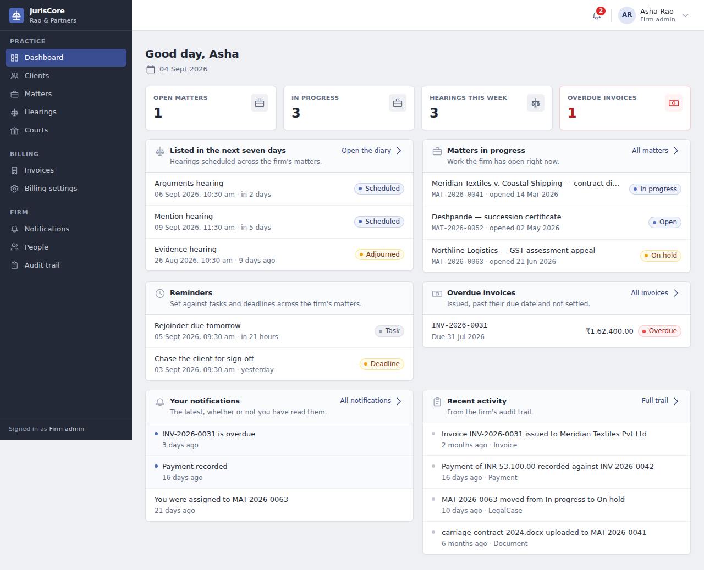

# JurisCore

Legal case management and court workflow for law firms: matters, hearings, deadlines,
documents and billing, in one multi-tenant application.

Each firm is a tenant with a hard boundary around its data. Every request is scoped to the
firm in the caller's token — no endpoint accepts a tenant identifier from the client — and a
lookup that crosses that boundary answers `404`, not `403`, so nothing leaks the existence
of another firm's records.



---

## Features

Everything listed here is implemented and covered by tests. Nothing is aspirational.

**Authentication & identity**
Firm self-registration; sign-in with short-lived JWT access tokens and rotating refresh
tokens; refresh-token reuse detection that revokes the whole session family; logout and
global revocation; password reset; user invitation and activation; account lockout after
repeated failures.

**Organizations & access control**
One organization per firm, and the tenant boundary itself. Five roles — `SUPER_ADMIN`,
`FIRM_ADMIN`, `LAWYER`, `CLERK`, `CLIENT` — enforced with `@PreAuthorize` next to each
handler, with the frontend's permission map mirroring those rules so no button is offered
that the server would refuse.

**Clients & lawyers**
Client records with contact and address details; lawyer assignment to matters; a
lead-lawyer invariant (a staffed matter has exactly one lead) enforced in the service and
by a partial unique index.

**Matters (cases)**
Matters with server-assigned case numbers (`MAT-YYYY-NNNN`, per firm, per year), status
lifecycle, description, client linkage, and an append-only timeline of everything that
happened to them.

**Hearings & courts**
Court registry; hearings scheduled against a court and a matter, with type, duration, judge,
courtroom and purpose; a status lifecycle the UI mirrors exactly (an adjourned hearing is
relisted or cancelled — it cannot jump to completed).

**Tasks & deadlines**
Tasks with priority, assignee and due date; deadlines with type and source; reminders
against either, dispatched by a background sweep that is safe to run on several instances at
once.

**Documents**
Upload straight from the browser to object storage over a presigned `PUT`, so file bytes
never pass through the application. Register → upload → complete, with storage as the
authority on the final size; a content-type allowlist, size ceiling and filename rules
enforced server-side and mirrored in the browser; soft delete with object cleanup after
commit.

**Billing & invoices**
Draft invoices with line items, tax and discount; server-authoritative totals (the browser
shows an estimate and says so); per-firm, per-year invoice numbering that is safe under
concurrency; issue and cancel transitions; recorded payments with overpayment and
currency-mismatch refusal; an hourly sweep that marks issued invoices overdue.

**Notifications**
In-app notifications for invoice, payment and case events, with per-user category
preferences and an unread count.

**Audit**
An append-only audit trail of who did what, queryable by firm administrators, with
credential-shaped values redacted before they are written.

**Security**
Detailed under [Security](#security).

---

## Architecture

A **modular monolith**: one deployable unit built from ten Maven modules that keep the
boundaries a service split would need — separate packages, separate database schemas, no
module reaching into another's repositories, and communication through domain events rather
than shared tables. Moving a module out later is a packaging change rather than a rewrite.
The reasoning is in [docs/ARCHITECTURE.md](docs/ARCHITECTURE.md).

| Module | Responsibility |
|---|---|
| `juriscore-common` | Shared kernel: response envelope, error catalogue, base entities, tenant context and guard, domain-event contracts |
| `juriscore-organization` | Law firms — the tenant boundary itself |
| `juriscore-identity` | Users, authentication, JWT, refresh tokens, RBAC, sessions |
| `juriscore-casework` | Clients, matters, lawyer assignments, matter timeline |
| `juriscore-case-management` | Courts, hearings, tasks, deadlines, reminders |
| `juriscore-documents` | Document metadata, upload policy, presigned storage access |
| `juriscore-billing` | Billing profile, invoices, line items, payments, numbering |
| `juriscore-notifications` | In-app notifications and per-user preferences |
| `juriscore-audit` | Append-only audit trail and its query API |
| `juriscore-app` | The deployable: configuration, migrations, filters, schedulers, composition |

Each domain module owns a PostgreSQL schema (`organization`, `identity`, `casework`,
`case_management`, `documents`, `billing`, `notifications`, `audit`). Cross-module
references are plain UUID columns rather than foreign keys, which is what keeps the
boundaries real.

---

## Tech stack

**Backend** — Java 21, Spring Boot 3.3.5 (Web, Data JPA, Security, Validation), PostgreSQL
16, Redis 7, Flyway, jjwt, AWS SDK v2 (S3), springdoc-openapi 2.6, Lombok.

**Frontend** — React 18.3, TypeScript 5.6, Vite 5.4, TanStack Query 5, React Router 6,
React Hook Form 7 with Zod 3, Tailwind CSS 3.

**Testing** — JUnit 5, AssertJ, Mockito, Spring Boot Test, Testcontainers 1.21 (real
PostgreSQL and Redis), Vitest 2 with React Testing Library and MSW.

**Infrastructure** — Docker and Docker Compose, LocalStack for S3 locally, GitHub Actions.

---

## Project structure

```
JurisCore/
├── juriscore-common/         Shared kernel
├── juriscore-organization/   Firms (tenant boundary)
├── juriscore-identity/       Auth, users, RBAC
├── juriscore-casework/       Clients, matters, assignments, timeline
├── juriscore-case-management/ Courts, hearings, tasks, deadlines, reminders
├── juriscore-documents/      Documents and storage policy
├── juriscore-billing/        Invoices, payments, billing profile
├── juriscore-notifications/  In-app notifications
├── juriscore-audit/          Audit trail
├── juriscore-app/            Deployable app, config, Flyway migrations
├── frontend/                 React + TypeScript client (own README)
├── docker/                   LocalStack bootstrap (S3 bucket, SQS queues)
├── docs/                     Architecture, local verification, screenshots
├── scripts/                  Build diagnosis, API smoke test
├── Dockerfile                Production image (multi-stage)
└── docker-compose.yml        Local development stack only — not for production
```

---

## Prerequisites

- JDK 21
- Maven 3.9+
- Docker and Docker Compose
- Node 20+ and npm (for the web client)

---

## Local development

### 1. Start the infrastructure

```bash
docker compose up -d postgres redis localstack
```

PostgreSQL and Redis are ready in a few seconds; LocalStack takes around 25 and creates the
document bucket on the way up. LocalStack is optional until you try to upload a document —
that flow has the browser `PUT` straight to storage, so without it the upload fails at a
step the server never sees.

### 2. Run the backend

```bash
export JAVA_HOME=$(/usr/libexec/java_home -v 21)   # macOS
mvn -pl juriscore-app -am spring-boot:run
```

The `local` profile is active by default and carries a development JWT secret, so a fresh
checkout runs with no further setup. Flyway applies the migrations at startup. The API is on
`http://localhost:8080`, Swagger UI on `http://localhost:8080/swagger-ui.html`.

### 3. Run the frontend

```bash
cd frontend
npm install
npm run dev
```

The client is on `http://localhost:3000` and proxies `/api`, `/actuator`, `/v3/api-docs` and
`/swagger-ui` to port 8080, so the browser makes same-origin requests and CORS is not
involved in development.

### 4. Optional: demo data and API smoke test

```bash
node frontend/scripts/fixtures.mjs      # seeds a firm with matters, invoices, documents
python3 scripts/smoke-test.py           # exercises the API end to end against a running app
```

[docs/LOCAL_VERIFICATION.md](docs/LOCAL_VERIFICATION.md) is the full procedure, from
prerequisites through teardown.

---

## Configuration

Every setting is an environment variable with a local-friendly default. Copy `.env.example`
to `.env` for local work; `.env` is gitignored and must never hold production values.

| Variable | Required in production | Purpose |
|---|---|---|
| `JURISCORE_JWT_SECRET` | **Yes** | Base64 HMAC key, ≥256 bits. No default — the application refuses to start without it |
| `JURISCORE_DB_URL` | **Yes** | JDBC URL for PostgreSQL |
| `JURISCORE_DB_USER` / `JURISCORE_DB_PASSWORD` | **Yes** | Database credentials |
| `JURISCORE_REDIS_HOST` / `JURISCORE_REDIS_PORT` | **Yes** | Redis, used for distributed rate limiting |
| `JURISCORE_CORS_ORIGINS` | **Yes** | Comma-separated allowed origins. Defaults to `http://localhost:3000` |
| `JURISCORE_PUBLIC_URL` | Recommended | Public base URL, used in the OpenAPI document |
| `AWS_REGION` | **Yes** | Region for S3 |
| `JURISCORE_AWS_ENDPOINT` | No | Endpoint override for LocalStack. **Leave empty in production** so the real AWS endpoints and the instance/task role are used |
| `AWS_ACCESS_KEY_ID` / `AWS_SECRET_ACCESS_KEY` | No | Read *only* when an endpoint override is set. Production authenticates with the task role |
| `JURISCORE_DB_POOL_SIZE` | No | HikariCP maximum pool size (default 20) |
| `JURISCORE_DOC_MAX_SIZE` | No | Maximum document size in bytes (default 50 MB) |
| `JURISCORE_OVERDUE_SWEEP` | No | Enables the overdue-invoice sweep (default true) |
| `SERVER_PORT` | No | HTTP port (default 8080) |

Frontend: `VITE_API_BASE_URL` sets the API origin for a client deployed separately from the
API. Leave it unset when the app and API are served from one origin behind a reverse proxy —
the client then uses relative paths.

---

## Running with Docker

### Development stack

`docker-compose.yml` is **for local development only**. It starts PostgreSQL, Redis and
LocalStack, and carries a development JWT secret and default database credentials in plain
text. Do not deploy it.

```bash
docker compose up --build        # everything, application included
docker compose up -d postgres redis localstack   # infrastructure only
```

### Production image

The `Dockerfile` builds a production image: a multi-stage build with a JRE-only runtime, a
non-root user, container-aware heap sizing, a health check against
`/actuator/health/readiness`, and `SPRING_PROFILES_ACTIVE=prod` as its default.

```bash
docker build -t juriscore:latest .
```

Configuration is supplied at run time through the environment variables above. The image
contains no secrets.

---

## Testing

```bash
# Backend — unit tests plus Testcontainers integration tests (needs Docker running)
export JAVA_HOME=$(/usr/libexec/java_home -v 21)
mvn -B clean verify

# Frontend — typecheck, ESLint, tests and production build
cd frontend
npm run verify
```

Last verified results:

| Suite | Result |
|---|---|
| Backend unit tests (`mvn -B test`, all 10 modules) | 617 tests, 0 failures, 0 errors, 0 skipped |
| Backend integration tests (Failsafe, `mvn -B verify`) | require a running Docker daemon — see below |
| Frontend (`npm run verify`) | 206 tests, 0 failures |
| TypeScript (`npm run typecheck`) | clean |
| ESLint (`npm run lint`) | 0 errors |
| Production build (`npm run build`) | passes |

The backend integration tests start real PostgreSQL and Redis containers through
Testcontainers, so Docker must be running. Individual suites:

```bash
mvn -B test                                   # unit tests only, no Docker needed
mvn -B verify -Dit.test=RefreshTokenConcurrencyIT
cd frontend && npx vitest run src/lib/auth
```

---

## Security

**Authentication.** BCrypt at strength 12. Access tokens are short-lived JWTs; refresh
tokens are long-lived, stored only as hashes, and rotated on every use. Presenting an
already-rotated token is treated as theft and revokes every session for that user. Rotation
takes a `SELECT … FOR UPDATE` row lock, so two concurrent refreshes cannot both succeed.
Sessions are revoked globally through a token-generation claim, which invalidates access
tokens that have not yet expired.

**Authorization.** Role checks live next to each handler as `@PreAuthorize`. The frontend's
permission map mirrors them, so the UI does not offer actions the server will refuse — but
the server is the only authority.

**Tenant isolation.** The organization comes from the access token and from nowhere else.
Repository lookups are scoped by `organization_id` and services check `TenantGuard`;
cross-tenant access returns `404` so record existence is not disclosed.

**Rate limiting.** A fixed-window limiter in Redis, keyed by user for authenticated traffic
and by peer address for anonymous traffic, with a much tighter budget on the authentication
endpoints. When Redis is unavailable the policy splits deliberately: authenticated API
traffic is allowed through, while authentication endpoints fall back to a bounded
per-instance limiter, so a Redis outage cannot remove the brute-force limit.

**Trusted proxy.** The client address comes from Tomcat's `RemoteIpValve`
(`forward-headers-strategy: native`), which honours `X-Forwarded-For` only when the request
arrived from a trusted proxy. No application code parses a forwarding header.

**CORS.** Explicit origin list, no wildcard, credentials disallowed — the API authenticates
with a bearer header the client sets itself, so no ambient credential should ever ride along.

**Documents.** Uploads go straight to object storage over a presigned URL; bytes never pass
through the application. Content type, size and filename are validated server-side against
an allowlist, and again against what storage actually reports at completion. Storage keys
are derived from firm, matter and document identifiers, never from the uploaded filename.

**API documentation.** Swagger UI and `/v3/api-docs` are available in development and
disabled in the `prod` profile, in both springdoc and the security chain.

**Error handling.** Clients receive a generic message and an incident id; stack traces, SQL,
constraint names and schema details stay in the log. Credential-shaped values are redacted
before they reach the audit trail.

No third-party security audit or certification has been performed on this codebase.

---

## Deployment

### Required infrastructure

- **PostgreSQL 16** — the application user needs rights to create the eight schemas Flyway
  manages, or they can be pre-created.
- **Redis 7** — used for distributed rate limiting. A Redis outage degrades rate limiting
  rather than taking the application down.
- **S3-compatible object storage** — one bucket for documents. The application authenticates
  with the instance/task role in production; leave `JURISCORE_AWS_ENDPOINT` empty.
- **A reverse proxy or load balancer** terminating TLS.

### Deploying

1. Build the image: `docker build -t juriscore:<tag> .`
2. Supply the environment variables listed under [Configuration](#configuration) from your
   secret manager. Never bake them into the image.
3. Set `SPRING_PROFILES_ACTIVE=prod` explicitly rather than relying on the image default.
4. Flyway applies migrations automatically at startup. On a first deployment against an
   empty database this creates the whole schema; check the startup log for the applied
   version.
5. Point the load balancer's health check at `/actuator/health/readiness`. Liveness and
   readiness are anonymous; everything else under `/actuator` requires `SUPER_ADMIN`, and
   health details are hidden in production.
6. Build and serve the frontend (`npm run build` produces `frontend/dist/`) from a static
   host or the same origin as the API behind the proxy. Set `VITE_API_BASE_URL` only if the
   client is served from a different origin.

### Deployment prerequisites the repository cannot guarantee

These are real requirements that no amount of application code satisfies. Verify each one.

- **The load balancer's source address must fall inside
  `server.tomcat.remoteip.internal-proxies`** (RFC1918, loopback, link-local and CGNAT
  ranges by default). An in-VPC AWS ALB always does. A proxy with a public address does not,
  and the consequence is quiet but severe: the valve discards `X-Forwarded-For`, every
  caller is keyed to the proxy's address, and the whole internet shares one rate-limit
  bucket. Confirm this before going live and widen the range if your proxy sits outside it.
- **An S3 lifecycle rule to expire orphaned objects.** A document delete marks the metadata
  deleted and then removes the object after commit; if that removal fails the object is
  left in the bucket on purpose, because the alternative is metadata pointing at nothing.
  Nothing in this repository creates that lifecycle rule.
- **TLS termination, backups, log shipping and monitoring** are all deployment concerns.
- **Database migration review.** Flyway runs on startup; if you prefer migrations gated
  behind a deliberate step, run them separately and disable `spring.flyway.enabled`.

### Production checklist

- [ ] Secrets supplied from a secret manager, not baked into the image
- [ ] Production PostgreSQL configured and reachable
- [ ] Redis configured and reachable
- [ ] S3 bucket created, task role granted access, `JURISCORE_AWS_ENDPOINT` empty
- [ ] S3 lifecycle rule for orphaned objects configured
- [ ] Load balancer address verified against the internal-proxies range
- [ ] `JURISCORE_CORS_ORIGINS` set to the real frontend origin
- [ ] `SPRING_PROFILES_ACTIVE=prod` set explicitly
- [ ] Flyway migrations applied and the startup log checked
- [ ] Health checks wired to `/actuator/health/readiness`
- [ ] `VITE_API_BASE_URL` set if the client is served from another origin
- [ ] HTTPS enforced at the proxy
- [ ] Backups, log shipping and monitoring configured

---

## Known limitations and operational notes

**Application limitations**

- Domain events are delivered in-process, ordered after commit. SQS queues exist in the
  local stack and in configuration, but no consumer is deployed — nothing is processed
  out-of-process.
- Refresh tokens are stored in browser `localStorage`, which is readable by any script on
  the origin. The hardened alternative is an httpOnly, SameSite cookie issued by the
  backend; that is a backend change and has not been made. Access tokens are held in memory
  only.
- One email address maps to one account platform-wide, so the same person cannot hold
  accounts at two firms.
- Full-text search over clients and matters uses `LIKE` with a leading wildcard and has no
  trigram index, so it scans the firm's rows. Fine at current scale; add `pg_trgm` before it
  is not.

**Future improvements**

- Move document storage to its own deployable when it earns a separate scaling profile.
- Presigned URL lifetime is asserted only as "positive" in tests; a concrete upper bound
  would be a better guard.

---

## Documentation

- [docs/ARCHITECTURE.md](docs/ARCHITECTURE.md) — module boundaries, event flow, design
  decisions and their trade-offs
- [docs/LOCAL_VERIFICATION.md](docs/LOCAL_VERIFICATION.md) — full local verification
  procedure
- [frontend/README.md](frontend/README.md) — web client structure, scripts and conventions

---

## Screenshots

| | |
|---|---|
|  |  |
|  |  |

The layout is responsive down to phone widths:


