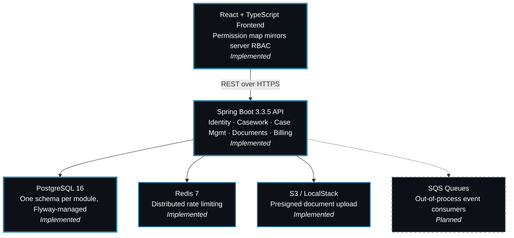
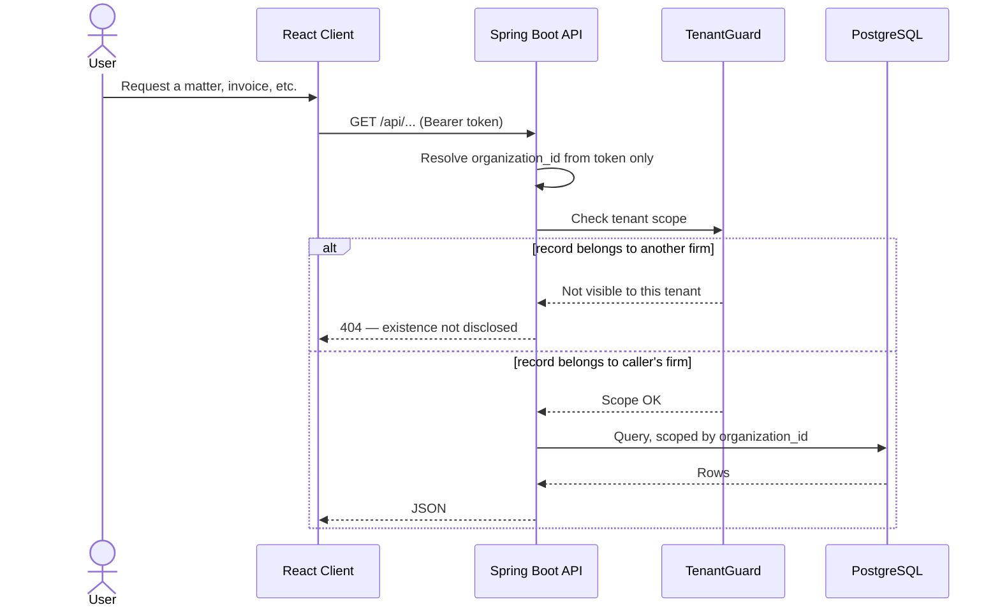
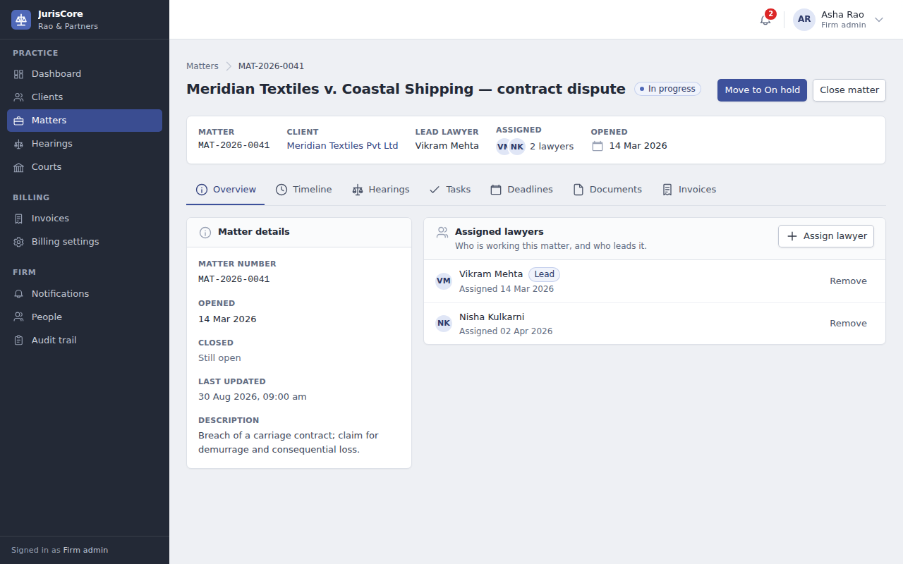
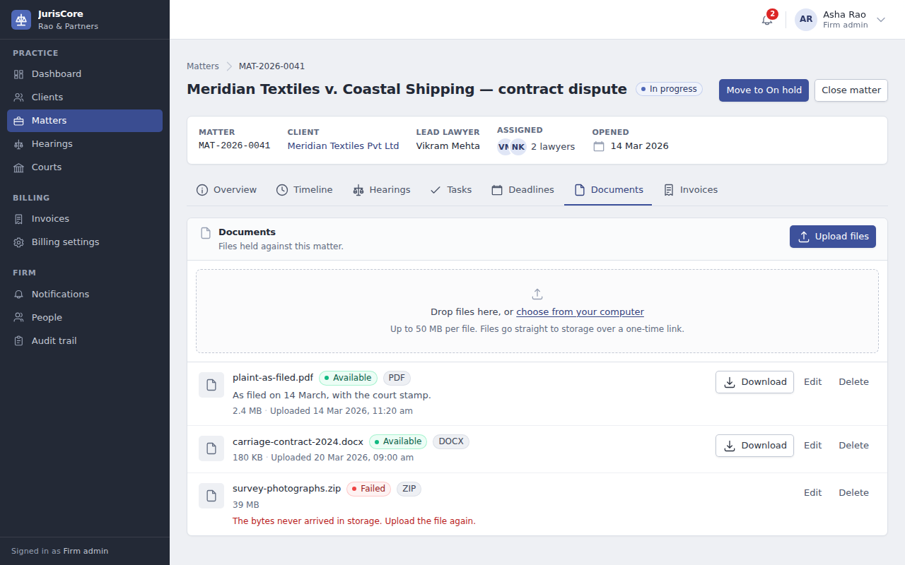
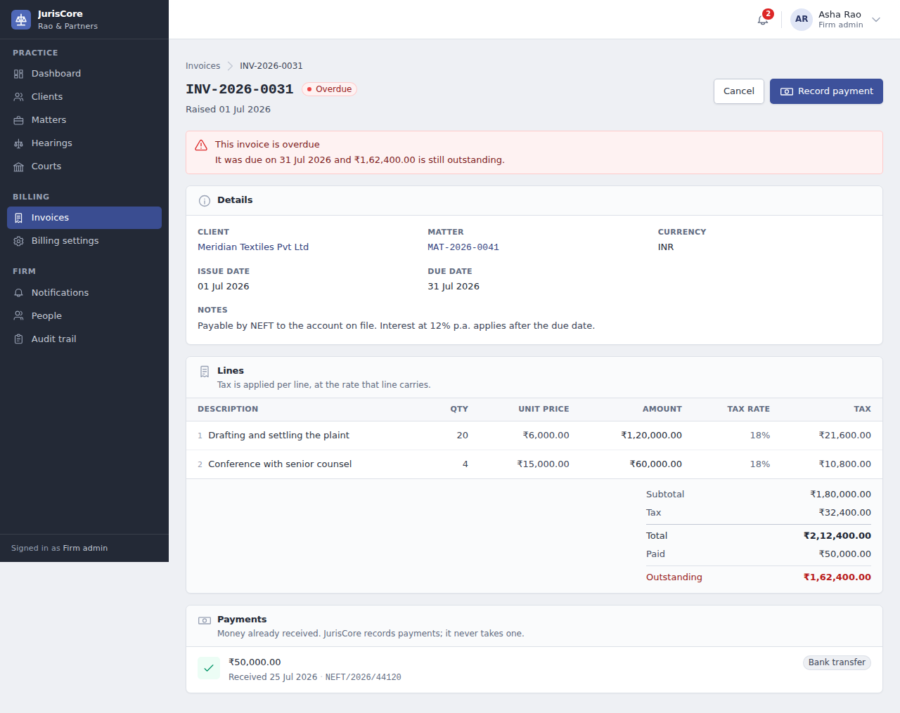
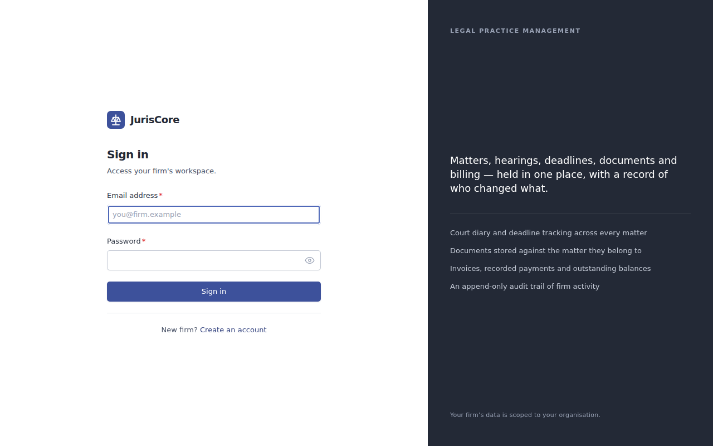
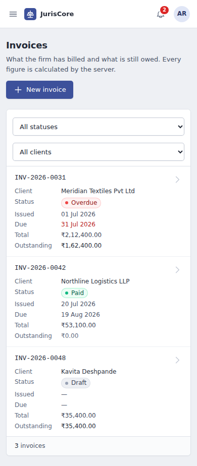

<div align="center">

<!-- Animated Typing Header -->
<a href="#">
</a>

<h3>Legal Case Management & Court Workflow for Law Firms</h3>

<p>A multi-tenant platform for matters, hearings, deadlines, documents and billing — with a hard tenant boundary that no endpoint can cross.</p>

<p>


</p>

<p>


</p>

</div>

---

## Contents

- [Overview](#overview)
- [What works today](#what-works-today)
- [Architecture](#architecture)
- [Tech stack](#tech-stack)
- [Project structure](#project-structure)
- [Local development](#local-development)
- [Configuration](#configuration)
- [Running with Docker](#running-with-docker)
- [Testing](#testing)
- [Security](#security)
- [Deployment](#deployment)
- [Known limitations and operational notes](#known-limitations-and-operational-notes)
- [Documentation](#documentation)
- [Screenshots](#screenshots)

---

## Overview

Law firms run on matters, hearings and deadlines that cannot be allowed to
leak between clients — let alone between firms. JurisCore is a multi-tenant
case management system built around that constraint: every request is scoped
to the firm in the caller's token, no endpoint accepts a tenant identifier
from the client, and a lookup that crosses the tenant boundary answers `404`,
not `403`, so nothing discloses that another firm's record exists at all.

**Five roles, one application.** `SUPER_ADMIN`, `FIRM_ADMIN`, `LAWYER`,
`CLERK` and `CLIENT`, enforced next to each handler and mirrored — never
duplicated as the source of truth — in the frontend's permission map.

> **Status.** Everything documented below is implemented and covered by
> tests. Nothing here is aspirational.

---

## What works today

**Authentication & identity**
Firm self-registration; short-lived JWT access tokens with rotating refresh
tokens; reuse detection that revokes the whole session family; global
revocation and logout; password reset; invitation and activation; lockout
after repeated failures.

**Organizations & access control**
One organization per firm — the tenant boundary itself. Five roles enforced
with `@PreAuthorize` next to each handler.

**Clients & lawyers**
Client records with contact and address details; lawyer assignment to
matters; a lead-lawyer invariant enforced both in the service layer and by a
partial unique index.

**Matters (cases)**
Server-assigned case numbers (`MAT-YYYY-NNNN`, per firm, per year), a status
lifecycle, client linkage, and an append-only timeline of everything that
happened to a matter.

**Hearings & courts**
Court registry; hearings scheduled with type, duration, judge, courtroom and
purpose; a status lifecycle the UI mirrors exactly — an adjourned hearing is
relisted or cancelled, never jumped straight to completed.

**Tasks & deadlines**
Tasks with priority, assignee and due date; deadlines with type and source;
reminders dispatched by a background sweep safe to run on several instances
at once.

**Documents**
Browser-to-storage upload over a presigned `PUT` — file bytes never pass
through the application. Register → upload → complete, with storage as the
authority on final size; allowlist, size ceiling and filename rules enforced
server-side and mirrored in the browser; soft delete with post-commit object
cleanup.

**Billing & invoices**
Draft invoices with line items, tax and discount; server-authoritative
totals; per-firm, per-year invoice numbering safe under concurrency; issue
and cancel transitions; payments with overpayment and currency-mismatch
refusal; an hourly sweep marking issued invoices overdue.

**Notifications**
In-app notifications for invoice, payment and case events, with per-user
category preferences and an unread count.

**Audit**
An append-only audit trail, queryable by firm administrators, with
credential-shaped values redacted before they are ever written.

**Security**
Detailed under [Security](#security).

---

## Architecture



<div align="center">

**Blue, solid** = implemented &nbsp;&nbsp;|&nbsp;&nbsp; **Grey, dashed** = planned

</div>

### Tenant-scoped request flow



No endpoint accepts a tenant identifier from the client — the organization
comes from the access token and from nowhere else.

### Modules

A **modular monolith**: one deployable unit built from ten Maven modules that
keep the boundaries a service split would need — separate packages, separate
database schemas, no module reaching into another's repositories, and
communication through domain events rather than shared tables. The reasoning
is in [docs/ARCHITECTURE.md](docs/ARCHITECTURE.md).

| Module | Responsibility |
|---|---|
| `juriscore-common` | Shared kernel: response envelope, error catalogue, base entities, tenant context and guard, domain-event contracts |
| `juriscore-organization` | Law firms — the tenant boundary itself |
| `juriscore-identity` | Users, authentication, JWT, refresh tokens, RBAC, sessions |
| `juriscore-casework` | Clients, matters, lawyer assignments, matter timeline |
| `juriscore-case-management` | Courts, hearings, tasks, deadlines, reminders |
| `juriscore-documents` | Document metadata, upload policy, presigned storage access |
| `juriscore-billing` | Billing profile, invoices, line items, payments, numbering |
| `juriscore-notifications` | In-app notifications and per-user preferences |
| `juriscore-audit` | Append-only audit trail and its query API |
| `juriscore-app` | The deployable: configuration, migrations, filters, schedulers, composition |

Each domain module owns a PostgreSQL schema (`organization`, `identity`,
`casework`, `case_management`, `documents`, `billing`, `notifications`,
`audit`). Cross-module references are plain UUID columns rather than foreign
keys — that's what keeps the boundaries real.

---

## Tech stack

| Layer | Choices |
|:---|:---|
| **Backend** | Java 21, Spring Boot 3.3.5 (Web, Data JPA, Security, Validation), jjwt, AWS SDK v2 (S3), springdoc-openapi 2.6, Lombok |
| **Database** | PostgreSQL 16, Flyway migrations |
| **Caching / rate limiting** | Redis 7 |
| **Frontend** | React 18.3, TypeScript 5.6, Vite 5.4, TanStack Query 5, React Router 6 |
| **Forms** | React Hook Form 7 + Zod 3 |
| **UI** | Tailwind CSS 3 |
| **Testing** | JUnit 5, AssertJ, Mockito, Spring Boot Test, Testcontainers 1.21, Vitest 2, React Testing Library, MSW |
| **Infrastructure** | Docker, Docker Compose, LocalStack (S3 locally), GitHub Actions |

---

## Project structure

```text
JurisCore/
├── juriscore-common/          Shared kernel
├── juriscore-organization/    Firms (tenant boundary)
├── juriscore-identity/        Auth, users, RBAC
├── juriscore-casework/        Clients, matters, assignments, timeline
├── juriscore-case-management/ Courts, hearings, tasks, deadlines, reminders
├── juriscore-documents/       Documents and storage policy
├── juriscore-billing/         Invoices, payments, billing profile
├── juriscore-notifications/   In-app notifications
├── juriscore-audit/           Audit trail
├── juriscore-app/             Deployable app, config, Flyway migrations
├── frontend/                  React + TypeScript client (own README)
├── docker/                    LocalStack bootstrap (S3 bucket, SQS queues)
├── docs/                      Architecture, local verification, screenshots
├── scripts/                   Build diagnosis, API smoke test
├── Dockerfile                 Production image (multi-stage)
└── docker-compose.yml         Local development stack only — not for production
```

---

## Local development

**Prerequisites:** JDK 21, Maven 3.9+, Docker and Docker Compose, Node 20+ and npm.

```bash
# 1. Infrastructure
docker compose up -d postgres redis localstack
#    LocalStack takes ~25s and creates the document bucket on the way up.
#    Optional until you try to upload a document — that flow PUTs straight
#    to storage, so without it the upload fails at a step the server never sees.

# 2. Backend
export JAVA_HOME=$(/usr/libexec/java_home -v 21)   # macOS
mvn -pl juriscore-app -am spring-boot:run
#    → http://localhost:8080   (Swagger UI at /swagger-ui.html)
#    `local` profile is active by default with a dev JWT secret — no further
#    setup needed. Flyway applies migrations at startup.

# 3. Frontend
cd frontend
npm install
npm run dev
#    → http://localhost:3000, proxying /api, /actuator, /v3/api-docs and
#    /swagger-ui to port 8080, so the browser never crosses origins.

# 4. Optional: demo data and smoke test
node frontend/scripts/fixtures.mjs      # seeds a firm with matters, invoices, documents
python3 scripts/smoke-test.py           # exercises the API end to end
```

Full procedure, from prerequisites through teardown:
[docs/LOCAL_VERIFICATION.md](docs/LOCAL_VERIFICATION.md)

---

## Configuration

Every setting is an environment variable with a local-friendly default. Copy
`.env.example` to `.env` for local work; `.env` is gitignored and must never
hold production values.

<details>
<summary><b>Full variable reference</b></summary>

| Variable | Required in production | Purpose |
|---|---|---|
| `JURISCORE_JWT_SECRET` | **Yes** | Base64 HMAC key, ≥256 bits. No default — the application refuses to start without it |
| `JURISCORE_DB_URL` | **Yes** | JDBC URL for PostgreSQL |
| `JURISCORE_DB_USER` / `JURISCORE_DB_PASSWORD` | **Yes** | Database credentials |
| `JURISCORE_REDIS_HOST` / `JURISCORE_REDIS_PORT` | **Yes** | Redis, used for distributed rate limiting |
| `JURISCORE_CORS_ORIGINS` | **Yes** | Comma-separated allowed origins. Defaults to `http://localhost:3000` |
| `JURISCORE_PUBLIC_URL` | Recommended | Public base URL, used in the OpenAPI document |
| `AWS_REGION` | **Yes** | Region for S3 |
| `JURISCORE_AWS_ENDPOINT` | No | Endpoint override for LocalStack. **Leave empty in production** |
| `AWS_ACCESS_KEY_ID` / `AWS_SECRET_ACCESS_KEY` | No | Read only when an endpoint override is set. Production uses the task role |
| `JURISCORE_DB_POOL_SIZE` | No | HikariCP maximum pool size (default 20) |
| `JURISCORE_DOC_MAX_SIZE` | No | Maximum document size in bytes (default 50 MB) |
| `JURISCORE_OVERDUE_SWEEP` | No | Enables the overdue-invoice sweep (default true) |
| `SERVER_PORT` | No | HTTP port (default 8080) |

Frontend: `VITE_API_BASE_URL` sets the API origin for a client deployed
separately from the API. Leave it unset when app and API share an origin
behind a reverse proxy — the client then uses relative paths.

</details>

---

## Running with Docker

**Development stack** — `docker-compose.yml` is for local development only. It
starts PostgreSQL, Redis and LocalStack, and carries a development JWT secret
and default database credentials in plain text. Do not deploy it.

```bash
docker compose up --build                        # everything, application included
docker compose up -d postgres redis localstack    # infrastructure only
```

**Production image** — the `Dockerfile` builds a multi-stage, JRE-only,
non-root image with container-aware heap sizing, a health check against
`/actuator/health/readiness`, and `SPRING_PROFILES_ACTIVE=prod` by default.
Configuration is supplied entirely at run time; the image contains no
secrets.

```bash
docker build -t juriscore:latest .
```

---

## Testing

```bash
# Backend — unit tests plus Testcontainers integration tests (needs Docker running)
export JAVA_HOME=$(/usr/libexec/java_home -v 21)
mvn -B clean verify

# Frontend — typecheck, ESLint, tests and production build
cd frontend
npm run verify
```

### Last verified results

| Suite | Result |
|---|---|
| Backend unit tests (`mvn -B test`, all 10 modules) | 617 tests, 0 failures, 0 errors, 0 skipped |
| Backend integration tests (Failsafe, `mvn -B verify`) | require a running Docker daemon |
| Frontend (`npm run verify`) | 206 tests, 0 failures |
| TypeScript (`npm run typecheck`) | clean |
| ESLint (`npm run lint`) | 0 errors |
| Production build (`npm run build`) | passes |

Backend integration tests start real PostgreSQL and Redis containers via
Testcontainers, so Docker must be running.

```bash
mvn -B test                                   # unit tests only, no Docker needed
mvn -B verify -Dit.test=RefreshTokenConcurrencyIT
cd frontend && npx vitest run src/lib/auth
```

---

## Security

<details open>
<summary><b>Authentication</b></summary>

BCrypt at strength 12. Access tokens are short-lived JWTs; refresh tokens are
long-lived, stored only as hashes, and rotated on every use. Presenting an
already-rotated token is treated as theft and revokes every session for that
user. Rotation takes a `SELECT … FOR UPDATE` row lock, so two concurrent
refreshes cannot both succeed. Sessions are revoked globally through a
token-generation claim, invalidating access tokens that have not yet expired.

</details>

<details>
<summary><b>Authorization</b></summary>

Role checks live next to each handler as `@PreAuthorize`. The frontend's
permission map mirrors them, so the UI does not offer actions the server will
refuse — but the server is the only authority.

</details>

<details>
<summary><b>Tenant isolation</b></summary>

The organization comes from the access token and from nowhere else.
Repository lookups are scoped by `organization_id` and services check
`TenantGuard`; cross-tenant access returns `404` so record existence is not
disclosed.

</details>

<details>
<summary><b>Rate limiting</b></summary>

A fixed-window limiter in Redis, keyed by user for authenticated traffic and
by peer address for anonymous traffic, with a much tighter budget on
authentication endpoints. When Redis is unavailable the policy splits
deliberately: authenticated API traffic is allowed through, while
authentication endpoints fall back to a bounded per-instance limiter, so a
Redis outage cannot remove the brute-force limit.

</details>

<details>
<summary><b>Trusted proxy, CORS & documents</b></summary>

- The client address comes from Tomcat's `RemoteIpValve`
  (`forward-headers-strategy: native`), which honours `X-Forwarded-For` only
  when the request arrived from a trusted proxy. No application code parses a
  forwarding header.
- Explicit CORS origin list, no wildcard, credentials disallowed — the API
  authenticates with a bearer header the client sets itself.
- Uploads go straight to object storage over a presigned URL; bytes never
  pass through the application. Content type, size and filename are
  validated server-side against an allowlist, and again against what storage
  actually reports at completion. Storage keys are derived from firm, matter
  and document identifiers, never from the uploaded filename.

</details>

<details>
<summary><b>API docs & error handling</b></summary>

Swagger UI and `/v3/api-docs` are available in development and disabled in
the `prod` profile, in both springdoc and the security chain. Clients receive
a generic message and an incident id; stack traces, SQL, constraint names and
schema details stay in the log. Credential-shaped values are redacted before
they reach the audit trail.

</details>

> No third-party security audit or certification has been performed on this codebase.

---

## Deployment

### Required infrastructure

- **PostgreSQL 16** — the application user needs rights to create the eight
  schemas Flyway manages, or they can be pre-created.
- **Redis 7** — distributed rate limiting. A Redis outage degrades rate
  limiting rather than taking the application down.
- **S3-compatible object storage** — one bucket for documents, authenticated
  via the instance/task role in production; leave `JURISCORE_AWS_ENDPOINT` empty.
- **A reverse proxy or load balancer** terminating TLS.

### Deploying

1. Build the image: `docker build -t juriscore:<tag> .`
2. Supply environment variables from your secret manager. Never bake them
   into the image.
3. Set `SPRING_PROFILES_ACTIVE=prod` explicitly.
4. Flyway applies migrations automatically at startup; check the startup log
   for the applied version.
5. Point the load balancer's health check at `/actuator/health/readiness`.
   Everything else under `/actuator` requires `SUPER_ADMIN`; health details
   are hidden in production.
6. Serve the frontend (`npm run build` → `frontend/dist/`) from a static host
   or the API's origin. Set `VITE_API_BASE_URL` only if served separately.

### Deployment prerequisites the repository cannot guarantee

- **The load balancer's source address must fall inside
  `server.tomcat.remoteip.internal-proxies`.** An in-VPC AWS ALB always does.
  A proxy with a public address does not — the consequence is quiet but
  severe: the valve discards `X-Forwarded-For`, every caller is keyed to the
  proxy's address, and the whole internet shares one rate-limit bucket.
- **An S3 lifecycle rule to expire orphaned objects.** A document delete
  marks the metadata deleted and removes the object after commit; if that
  removal fails, the object is left in the bucket on purpose. Nothing in this
  repository creates that lifecycle rule.
- **TLS termination, backups, log shipping and monitoring** are deployment concerns.
- **Database migration review.** Flyway runs on startup; gate it behind a
  deliberate step by disabling `spring.flyway.enabled` and running migrations
  separately if preferred.

### Production checklist

- [ ] Secrets supplied from a secret manager, not baked into the image
- [ ] Production PostgreSQL configured and reachable
- [ ] Redis configured and reachable
- [ ] S3 bucket created, task role granted access, `JURISCORE_AWS_ENDPOINT` empty
- [ ] S3 lifecycle rule for orphaned objects configured
- [ ] Load balancer address verified against the internal-proxies range
- [ ] `JURISCORE_CORS_ORIGINS` set to the real frontend origin
- [ ] `SPRING_PROFILES_ACTIVE=prod` set explicitly
- [ ] Flyway migrations applied and the startup log checked
- [ ] Health checks wired to `/actuator/health/readiness`
- [ ] `VITE_API_BASE_URL` set if the client is served from another origin
- [ ] HTTPS enforced at the proxy
- [ ] Backups, log shipping and monitoring configured

---

## Known limitations and operational notes

| Limitation | Detail |
|:---|:---|
| **Events are in-process** | Ordered after commit. SQS queues exist in the local stack and in configuration, but no consumer is deployed — nothing is processed out-of-process |
| **Refresh tokens in `localStorage`** | Readable by any script on the origin. The hardened alternative — an httpOnly, SameSite cookie issued by the backend — is a backend change that has not been made. Access tokens are held in memory only |
| **One account per email, platform-wide** | The same person cannot hold accounts at two firms |
| **Search has no trigram index** | Full-text search over clients and matters uses `LIKE` with a leading wildcard and scans the firm's rows. Fine at current scale; add `pg_trgm` before it is not |

**Future improvements**

- Move document storage to its own deployable when it earns a separate scaling profile.
- Presigned URL lifetime is asserted only as "positive" in tests; a concrete upper bound would be a better guard.

---

## Documentation

| Document | Covers |
|:---|:---|
| [docs/ARCHITECTURE.md](docs/ARCHITECTURE.md) | Module boundaries, event flow, design decisions and their trade-offs |
| [docs/LOCAL_VERIFICATION.md](docs/LOCAL_VERIFICATION.md) | Full local verification procedure |
| [frontend/README.md](frontend/README.md) | Web client structure, scripts and conventions |

---

## Screenshots

| | |
|---|---|
|  |  |
|  |  |

The layout is responsive down to phone widths:



---

<div align="center">

**JurisCore** — legal case management, one tenant boundary at a time.

</div>
